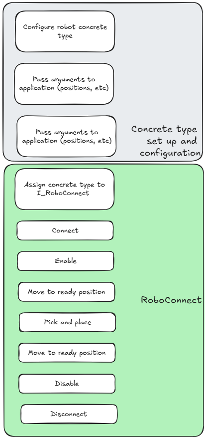
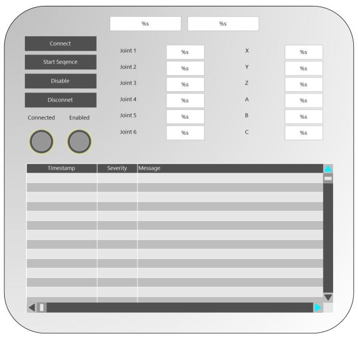

# Intro 

In this example we set up and use robo connect for a pick and place sequence. 

We have two implementations of RoboConnect, for a six axis arm, and for a 4 axis robot, where the 4th axis is always parallel with the base. As both are abstracted by RoboConnect, we are reusing the same application logic.


# Program 

In the program there is a simple state machine to initialise, connect and start the pick and place sequence. After the sequence is completed we can disable and disconnect from the robot. 

## Setup
With all RoboConnect applications, the concrete instance of the robot control must first be instantiated and configured. This is then passed to an I_RoboConnect interface where it can then be used generically. Below shows the steps for our trivial example.



The program also comes with a small HMI for operation. 



In the HMI there is command buttons for connecting, starting the sequence, disabling and disconnecting. With feedback for cartesian positions and joint positions. Below is an event logger for the program.

## Usage 

To use the program, first decide whether the Mg400 or the Nova 5 is your target robot. Comment out the ip address of the robot you are **not** using. Then activate the configuration and open the HMI. Normal operation would involve, connecting and starting the sequence. After starting the seuqnce the robot will enable, move to pick and cycle through the pick and place trajectory. 

Once the program is completed it is important to disable the robot and disconnect. 

## Explanation 

### Set Up & Configuring

The program will only run the code RoboConnect after the interface has been set. 

``` PASCAL
IF RoboConnect <> 0 THEN
  RoboConnect.CyclicLogic();
END_IF 
```
In the initlaisation state logging parameters are set, this is for generic logging and ties the HMI event logger to the main logger so no work is done twice. After that we configure the Robot. 

```
  Init:
    Intecre_Utilities.LogConfig.LogLevel := E_LogSeverity.Debug;
    Intecre_Utilities.LogConfig.ExternalLogger := hmiLogger;
    ConfigureDobotTypeAndPositions();

    logger.LogInfo('Initialised');
    state := DISCONNECTED;
```

This is the most important step in setting RoboConnect. For simplicity, if the corosponing ip address is set then configure the robot. In this case the kinnematics of the robot is different so there is another set of positions for the pick and place. If however, the robots had the same reach then the same set of positions could be used. 

```
{IF defined (variable: ipNova)}
CrNova.SetConnectionProperties(ipNova);
RoboConnect := CrNova;
homePosition := homePositionCr;
hoverPlacePosition := hoverPlacePositionCr;
placePosition := placePositionCr;
readyToPickPosition := readyToPickPositionCr;
pickPosition := pickPositionCr;

{ELSIF defined (variable: ipMg400)}
Mg400.SetConnectionProperties(ipMg400);
RoboConnect := Mg400;
homePosition := homePositionMg;
hoverPlacePosition := hoverPlacePositionMg;
placePosition := placePositionMg;
readyToPickPosition := readyToPickPositionMg;
pickPosition := pickPositionMg;

{ELSE}
{error 'Missing Connection properties.'}
{END_IF}
```
Specifically **RoboConnect := CrNova;** will set the instance of RoboConnect we are using in the program. 

**CrNova.SetConnectionProperties(ipNova);** is not a method of RoboConnect. We have to extend the robot to give custom information that our instance of RoboConnect needs. In this case we are connecting via TCP so the ip adress must be set. This however, could be changed to anything that we need. For example, a modbus connection.

### Connecting 

Very simply we call connect and wait till the robot is connected. Since we set out connection properties our instance of RoboConnect will do whatever it needs to connect behind in the concrete type. 

## Running The Trajectory

In this example there is a small trajectory runner to cycle through the pick and place commands. 

First the robot is enabled. Each command in RoboConnect will output a task. This task can be tracked to follow its progress. 

First issue the command and return the task. If the result of the task is empty then there is an error. Query the task to see if its done or there is an error in the task.  

An error in the task might be an invalid parameter. 

```
  REQUEST_ENABLE:
    IF StateChanged() THEN
      RoboConnect.Enable(task => resultTask);
    END_IF

    IF resultTask = 0 THEN
      logger.LogError('result task is null');
      state := ERROR_STATE;

    ELSIF resultTask.Error THEN
      state := ERROR_STATE;

    ELSIF resultTask.Done THEN
      state := WAIT_FOR_ENABLED;
    END_IF
```


After this the robot moves to the start position and waits till it is in the start position. RoboConnect comes with an inposition method and can also be configurable to determin the distance for being in position.

```
  REQUEST_START_POSITION:
    IF StateChanged() THEN
      RoboConnect.MoveAbs(point := homePosition, task => resultTask);
    END_IF

    IF resultTask = 0 THEN
      logger.LogError('result task is null');
      state := ERROR_STATE;

    ELSIF resultTask.Error THEN
      state := ERROR_STATE;

    ELSIF resultTask.Done THEN
      state := WAIT_FOR_START_POSITION;
    END_IF

  WAIT_FOR_START_POSITION:
    StateChanged();

    IF RoboConnect.IsAtCartesianPosition(homePosition) THEN
      state := GOTO_READY_TO_PICK_POS;
    END_IF
```

Then the program will start the pick and place sequnece. T_TrajectoryRunner will cycle through the points issuing the commands. After the positions have been executed the state will return to IDLE state. 

```
      REQUEST_PICK_AND_PLACE:

    IF StateChanged() THEN
      trajectoryRunner(
        execute := FALSE
      );

      movePositions[1] := readyToPickPosition;
      movePositions[2] := pickPosition;
      movePositions[3] := readyToPickPosition;
      movePositions[4] := hoverPlacePosition;
      movePositions[5] := placePosition;
      movePositions[6] := hoverPlacePosition;
      movePositions[7] := homePosition;
      movesInTrajectory := 7;

    END_IF

    TrajectoryRunner(
      targetRobot := RoboConnect,
      trajectory := movePositions,
      moveCount := movesInTrajectory,
      execute := TRUE
    );

    IF TrajectoryRunner.Error THEN
      state := ERROR_STATE;

    ELSIF TrajectoryRunner.Done THEN
      state := IDLE;

    END_IF
```

Also there are command for disabling and disconnecting the robot. Disable works the same as enable but issuing the disable command. 

```
  REQUEST_DISABLE:
    IF StateChanged() THEN
      RoboConnect.Disable(task => resultTask);
    END_IF

    IF resultTask = 0 THEN
      logger.LogError('result task is null');
      state := ERROR_STATE;

    ELSIF resultTask.Error THEN
      state := ERROR_STATE;

    ELSIF resultTask.Done THEN
      state := WAIT_FOR_DISABLE;
    END_IF

  WAIT_FOR_DISABLE:
    StateChanged();

    IF NOT RoboConnect.Enabled THEN
      state := IDLE;
    END_IF
```
Disconnect will disconect from the tcp sockets. This is **important** to do when using the dobot. Id the connection is not properly ended then it cannont connect again and a reboot of the robot is required.

```
  DISCONNECT:
    StateChanged();
    RoboConnect.Disconnect();
    state := DISCONNECTED;
```
