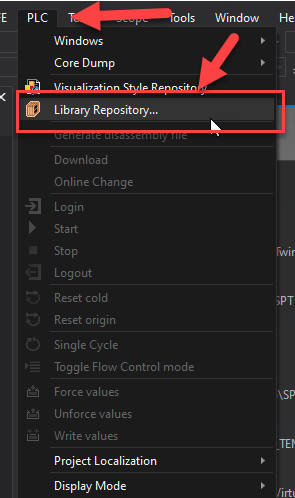
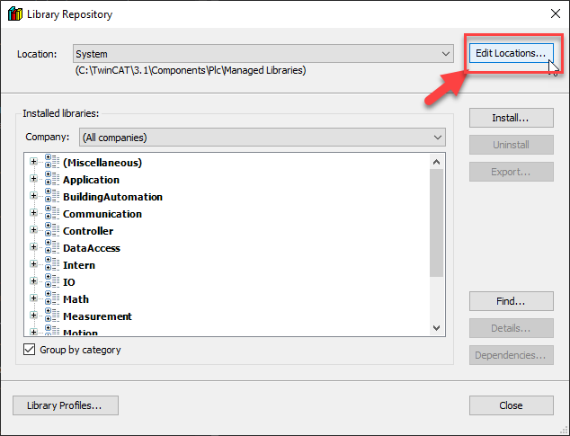
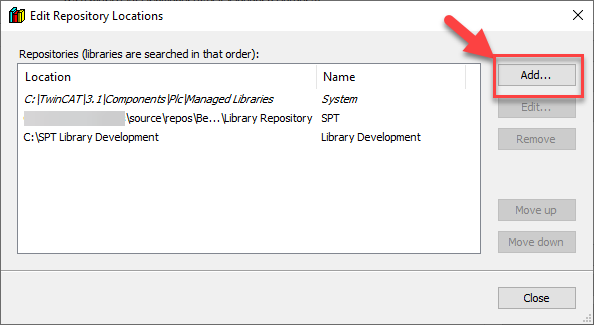
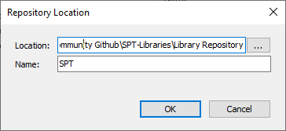

These libraries go hand-in-hand with the [VFFS Demo PLC](https://github.com/Beckhoff-USA-Community/PackML_PLC_Example).

This sample is created by [Beckhoff Automation LLC](https://www.beckhoff.com/en-us/)., and is provided as-is under the MIT license.

## How to get support
For support, raise an issue on [GitHub](#).

For general TwinCAT and Beckhoff Product support, please contact your local [Beckhoff Support](https://www.beckhoff.com/support/).

## Adding this repo as a TwinCAT PLC Library Repository

1. Clone this repository to your PC

2. Open the Library Repository

{ align=none, loading=lazy }

3. Click Edit Locations...

{ align=none, loading=lazy }

4. Click Add...

{ align=none, loading=lazy }

5. Browse to the folder where you cloned this repository and give the PLC Library Repository a name (e.g. RoboConnect Libraries). NOTE The location MUST point to the \Library Repository folder under the repo root!

{ align=none, loading=lazy }

6. Future updates to the RoboConnect libraries will automatically propogate into TwinCAT XAE by fetching this repo.