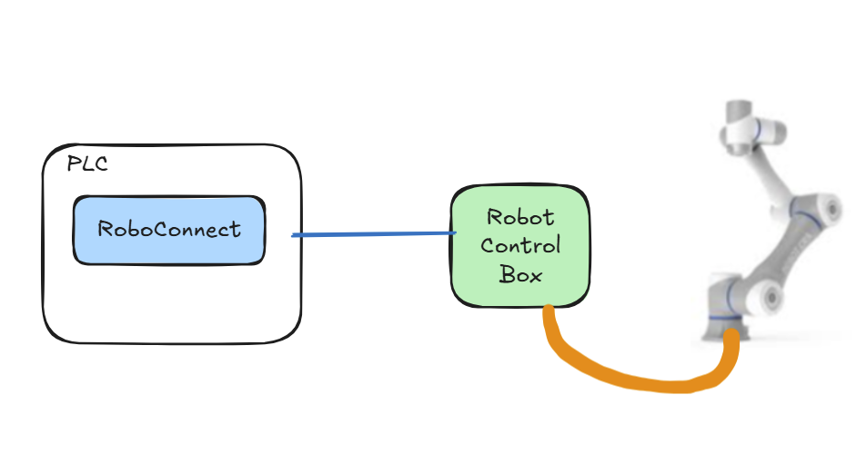
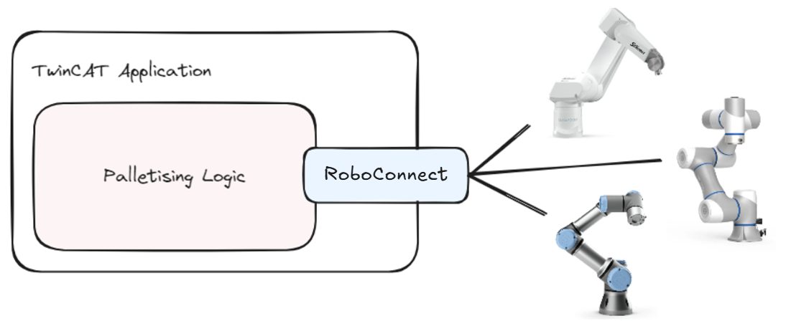

---
hide:
  - navigation
  - toc
---

# RoboConnect 

RoboConnect is an un-opinionated, robot abstration layer for TwinCAT.

[Get Started](getting_started.md){ .md-button .md-button--primary } 
[Example Project](exampleProject.md){ .md-button .md-button--primary } 
[Go to GitHub](https://github.com/plc-roboconnect){ .md-button }

## Simplifying Integration of Robotics.
It is a generic library providing robot functionality to TwinCAT (TC) users. It simplifies integration of any robot into the TwinCAT system by providing a common set of functionalities to PLC developers. It is designed to be familiar to users of Beckhoff’s Motion library, TC_MC2, but can also be used with Object Oriented Programming (OOP) techniques.

RoboConnect is an open-source library, available on an MIT license, meaning it can be used and modified without consent or attribution. 

There is no requirement for users of RoboConnect to make their libraries open source or freely available. HOwever, if you users are making a new connectivity library for a particular robot brand & model, it will help the community grow to make this open source, either through the RoboConnect organisation's [GitHub](https://github.com/plc-roboconnect), or through their own public repo.

##	One Abstraction, Many Robots
RoboConnect is an abstraction layer. It does not offer any out-of-the box kinematics. RoboConnect does not natively handle kinematics. It is designed to be an abstraction around robot controllers, such that one robot controller can be switched for another, with no change to the PLC code required to control it (if the degrees of freedom, reach and load capabilities match).
RoboConnect can be used with robots of any given form, from two axes upwards. 

It provides functionality to move robots in joint or cartesian space but does not place limitations on the degrees of freedom, or the shape and relationship of the kinematic chain. RoboConnect does not provide the kinematic solutions, they are delegated to something else. Typically, this will be a dedicated robot controller, but it could also be a cartesian or delta robot running directly on the Beckhoff NC, an XY gantry or anything else in between. 

{ width="600"}

## Maximising Reuse of application code, minimising "special" code.
Commonly in projects with robot integrations, a custom interface is derived between PLC and robot, with a mechanism for requesting certain jobs and perhaps passing data for a job and receiving results forming part of the interface. RoboConnect aims to move beyond this, giving end users the ability to write their application code in a familiar way within the PLC, then reuse that functionality against any robot supporting the interface.

{width = "600"}

## Challenges with Diverse Robot APIs:
-	Varied Commands & Protocols: Necessitates constant adaptation, increasing the learning curve.
-	Increased Development Time: Each unique API extends the timeline for integration and deployment.
-	Complex Maintenance: Independent API evolutions complicate updates and system maintenance.
-	Integration Difficulties: Makes it challenging to integrate and manage multiple robotic systems.

##	Benefits of a Common Interface:
-	Uniform Command Set: Simplifies development with standardised interactions.
-	Code Reusability & Maintenance: Reduces repetitive coding and simplifies updates.
-	Accelerated Deployment: Streamlines the integration process, shortening development cycles.
-	Enhanced Scalability: Facilitates simplified addition and integration of new robots.
-	Focus on Innovation: Frees resources to improve and innovate on robotic functionalities.

