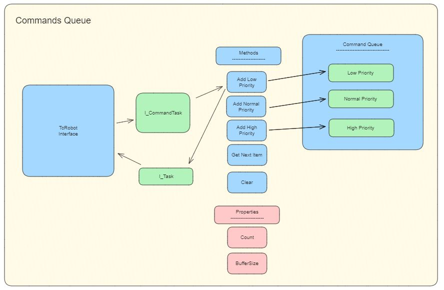

# TCP Commands

If the robot uses TCP messages to control the robot then robo_connect has two command helper classes to manage the flow of messages to the robot. As a user sends commands to the robot the concrete implementation of RoboConnect will implement the command queue and command invoker to manage these. 


## Command Queue 

The command queue holds the commands in a priority based FIFO queue. 


From the the interface the command will be accepted. Inside the method a an I_Task is taken from the command queue and populated with the relavant command string. The command is then added to the command queue at a specific priority level. 

Priority levels are be set at the developers decision but it is recommended that saftey critical command are set at top priority. 

For example Movj for Dobot CR3 is set at normal priority and stop is set at high priority. 

These commands are then dequeued by the Command Invoker 

## Command Invoker 

The command invoker is responsible for taking the commands from the queue and processing them. To do this there is a state machine that will wait for new command in the queue then process the command. After the command is send it will look for another.

```pascal 
CASE state OF
  IDLE:
    IF _commandQueue.Count > 0 THEN
      state := GET_COMMAND;
    END_IF

  GET_COMMAND:
    IF _commandQueue.GetNext(output_command => currentCmd) THEN
      state := PROCESSING;
    END_IF

  PROCESSING:

    IF StateChanged() THEN
      currentCmd.Execute();
    END_IF

    IF currentCmd.Done THEN
      state := IDLE;
    END_IF
END_CASE
```